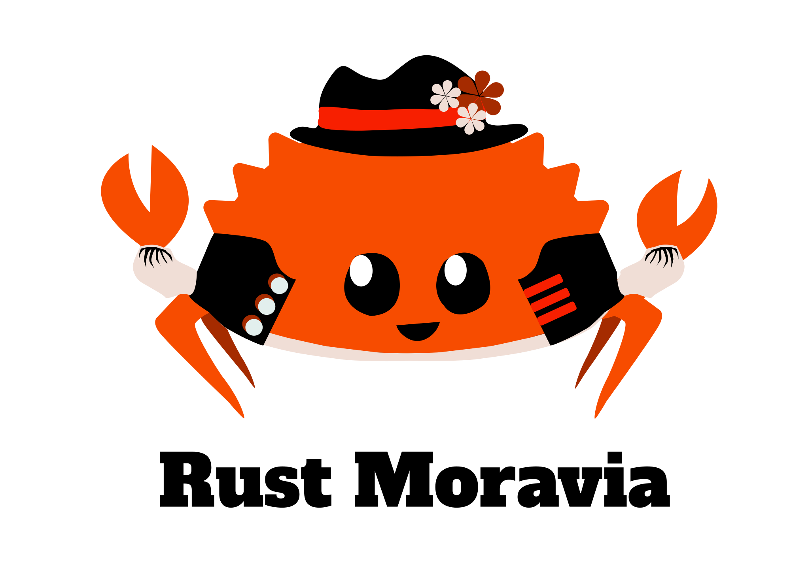

------------------------------------------------------------------
marp: true
footer: github.com/tencek/rust-fp
------------------------------------------------------------------

<!-- _footer: "" -->



------------------------------------------------------------------

# Functional Programming in Rust

------------------------------------------------------------------


Pavel Kučera

- C++ developer since ~2006
- C#/.NET developer since ~2015
- Fan of FP since ~2018 (F#)
- Fan of Rust since 2023

------------------------------------------------------------------

<!-- paginate: true -->

What Rust looks like from the FP point of view. What I was looking for, what I have found, what I am missing.

------------------------------------------------------------------

## What is Functional Programming?

- Function is a basic building block
- Function is a "first class citizen" so a function can be
  - called (obviously)
  - assigned to a variable / expression and call by name
  - passed as an argument
  - returned from another function
  - composed
  
------------------------------------------------------------------

## What is a Function?

```text
      +-------+
      |       |
x --> |   F   | --> y 
      |       |
      +-------+
```

- A "box"
- Single input, Single output
- Every input produces an output (**totality**)
- Same input => same output (**stateless**)
- No side effects (**immutability**)

Quite an limitation! (For good reasons, FPs believe)

------------------------------------------------------------------

```text
      +---+
x --> | F | --> y
      +---+
```

```text
      +---+     +---+
x --> | F | --> | G | --> y
      +---+     +---+
```

```text
         +---+
    +--> | F | --+
    |    +---+   |
x --|            |--> y
    |    +---+   |
    +--> | G | --+
         +---+
```

------------------------------------------------------------------

```text
          +-------+
+---+     |       |
| F | --> |   G   | --> y 
+---+     |       |
          +-------+
```

```text
      +-------+      
      |       |     +---+
x --> |   F   | --> | G | 
      |       |     +---+
      +-------+      
```

```text
          +-------+      
+---+     |       |     +---+
| F | --> |   G   | --> | H | 
+---+     |       |     +---+
          +-------+      
```


------------------------------------------------------------------

## 01 - `let`

- **Nechť** (Czech for "let")
- Originates from LISP
- Resembles mathematics
- **immutable** by default (not a "variable")
- Expressions over statements
- keywords in other languages: `var`, `Dim`, `def`, `set`, `my`
  - `let` is a good choice (-:

------------------------------------------------------------------

## 01 - `let` - shadowing

```rust
#[test]
fn test_coffee_machine() {
    let coffee_machine = CoffeeMachine::from(CoffeeMachineSettings::default());
    let coffee_machine = coffee_machine.with_small_size();
    let coffee_machine = coffee_machine.with_max_strength();

    let coffee = coffee_machine.brew();
    assert!(coffee.is_ok());

    let coffee = coffee.unwrap();
    assert_eq!(coffee.water_ml, 30);
    assert_eq!(coffee.caffeine_mg, 40);
}
```

------------------------------------------------------------------

## 01 - `let`

### Summary
- `let` keyword
- immutable
- shadowing (expression evaluation)

### 💚 A++

[demo_01_let.rs](https://github.com/tencek/rust-fp/tree/main/demos/src)

------------------------------------------------------------------

## 02 - partial (non-total) functions

### Recap

- Every input produces an output (**totality**)
- What if not? 
- Partial function == undefined behavior

### Example

```rust
// Undefined behavior if bean_weight_mg == 0
pub fn count_beans(portion_weight_mg: i32, bean_weight_mg: i32) -> i32 {
    portion_weight_mg / bean_weight_mg
}
```

------------------------------------------------------------------

## 02 - partial (non-total) functions

 - Rust behavior - panics
 - many languages (F# included) have some sort of exceptions

### Solution in rust

The only option in Rust is to create a total function instead:

```rust
pub fn count_beans(portion_weight_mg: i32, bean_weight_mg: i32) -> Option<i32> {
    portion_weight_mg.checked_div(bean_weight_mg)
}
```

- Client code is forced to check the returned `Option`
- The `checked_div` is a Rust `std` function. There are others as well for intiger overflow, string parse, etc.

------------------------------------------------------------------

## 02 - partial (non-total) functions

### Summary
 - Rust is even more FP than e.g. F#

### 💚 A++ 

[demo_02_partial_fn.rs](https://github.com/tencek/rust-fp/tree/main/demos/src)

------------------------------------------------------------------

## Algebraic data types

 * Sum type
 * Product type
 * Tuple
 * unit type
 * Newtype
 * type alias
 * ...

------------------------------------------------------------------

## `enum` - the **sum** type

- So called **Discriminated union**
- The **OR** type
- `enum` is not a great name but who cares
- Different kinds of enum variants
- Exhaustive pattern matching

### example

```rust
pub enum CoffeeOrder {
    Instant3In1,                                 // the unit variant
    Espresso { size: Size, strength: Strength }, // the struct variant
    PourOver(Temperature, Time),                 // the tuple variant
    Other(BrewingMethod),                        // another enum inside
}
```


------------------------------------------------------------------

## `enum` - why **sum** type?
- The cardinality (number of possible values) are the sum of the cardinalities of all the variants

### Quiz
What is the cardinality of `Bean` type?
```rust
pub enum Bean {
    Arabica,
    Robusta,
    Blend(BlendType),
}

pub enum BlendType { Arabica50Robusta50, Arabica40Robusta60, Arabica60Robusta40 }
```


------------------------------------------------------------------

## `enum` - pattern matching

```rust
impl Display for CoffeeOrder {
     fn fmt(&self, f: &mut Formatter) -> fmt::Result {
        match self {
            CoffeeOrder::Instant3In1 => write!(f, "Instant 3-in-1 coffee"),
            CoffeeOrder::Espresso { bean, strength } => write!(
                f,
                "Espresso with {:?} beans and {:?} strength",
                bean, strength
            ),
            CoffeeOrder::PourOver(temperature, time) => {
                write!(f, "Pour-over at {}°C for {} seconds", temperature, time)
            }
            CoffeeOrder::Other(method) => write!(f, "Other method: {:?}", method),
        }
    }
}
```

------------------------------------------------------------------

## `struct` - the **product** type
- Also called **record**
- The **AND** type
- destructuring
- exhaustive pattern matching

### example

```rust
pub struct Espresso {
    pub size: Size,
    pub strength: Strength,
    pub milk: Option<Milk>,
}
```

------------------------------------------------------------------

## `struct` - why **product** type?

- The cardinality (number of possible values) is the product of cardinalities of all the fields

### Quiz

What is the cardinality of `Espresso`?

```rust
pub struct Espresso { pub size: Size, pub strength: Strength }

pub enum Size     { Small, Medium, Large, ExtraLarge }
pub enum Strength { Light, Medium, Strong }
```

------------------------------------------------------------------

## `struct` - destructuring

```rust
pub fn make_espresso(espresso: Espresso) -> Coffee {
    let Espresso {
        size,
        strength,
        milk,
    } = espresso;

    todo!("Let's make it!")
}
```

------------------------------------------------------------------

## tuples
- anonymous structs
- mainly for intermediate results
- exhaustive pattern matching
- destructuring

```rust
pub fn choose_cup_color(espresso: Espresso) -> String {
    let color_args = (espresso.size, espresso.strength);
    let cup_color = match color_args {
        (Size::Small, Strength::Strong) => "black",
        (Size::Medium, Strength::Strong) => "red",
        (Size::Large, Strength::Strong) => "brown",
        _ => "white",
    };
    cup_color.to_string()
}
```

------------------------------------------------------------------

## 03 - Algebraic data types

### Summary
- **AND** and **OR** types
- The **New type** idiom
- Destructuring
- Pattern matching
- A struct in an enum 

### 💚 A++

[demo_03_algebraic_data_types.rs](https://github.com/tencek/rust-fp/tree/main/demos/src)

------------------------------------------------------------------

## Currying, partial application

------------------------------------------------------------------

## Higher order functions

------------------------------------------------------------------

## Pattern matching

------------------------------------------------------------------

## Function composition

------------------------------------------------------------------

## Recursion

------------------------------------------------------------------

## Skipped
# Recursive types
# new type
# unit type

------------------------------------------------------------------

------------------------------------------------------------------

## 💚 💛 🧡 💔
